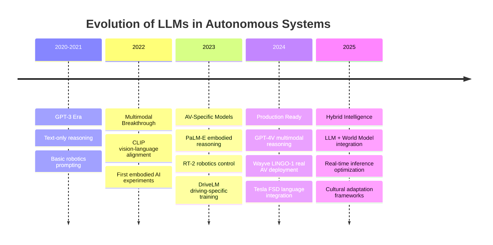

# Large Language Models: The Reasoning Engine of Autonomous Vehicles

<div align="center">

*"Language is the most powerful tool humanity has ever created. Now, it's driving our cars."*

[](#embodied-llms)
[](#research-papers)
[](#av-applications)

</div>

---

## Why LLMs for Autonomous Vehicles?

Large Language Models bring **human-like reasoning** to autonomous systems:

- **Natural Communication**: "Take me to the hospital, it's urgent!"
- **Contextual Understanding**: Interpreting complex traffic situations
- **Goal-Oriented Planning**: "Park near the entrance, but avoid blocking traffic"
- **Common Sense Reasoning**: Understanding implicit traffic rules and social norms
- **Few-Shot Adaptation**: Learning new driving behaviors from minimal examples

---

## Architecture Evolution



---

## Embodied LLMs for Robotics

### **Foundation Models**
*General-purpose embodied intelligence*

| Model | Organization | Year | Key Innovation | AV Relevance | Access |
|-------|-------------|------|----------------|--------------|--------|
| **PaLM-E** | Google | 2023 | Multimodal embodied reasoning | Sensor-language grounding | Research |
| **RT-2** | DeepMind | 2023 | Vision-language-action model | Real-time robotic control | Research |
| **VLA** | Various | 2025 | Open vision-language-action framework | Scalable AV deployment | [GitHub](https://github.com/openvla/openvla) |
| **Octo** | UC Berkeley | 2024 | Open-source generalist robot policy | Multi-task learning | [GitHub](https://github.com/octo-models/octo) |

### **AV-Specific LLMs**
*Models designed specifically for driving tasks*

| Model | Organization | Year | Key Innovation | Specialization | Status |
|-------|-------------|------|----------------|----------------|--------|
| **LINGO-1** | Wayve | 2023 | First production LLM-AV system | Real-world deployment | Production |
| **LINGO-2** | Wayve | 2025 | Advanced reasoning + control | End-to-end driving | Production |
| **DriveLM** | NVIDIA | 2024 | Language-augmented perception | Multimodal understanding | Research |
| **DriveGPT** | Baidu | 2024 | Chinese-optimized driving model | Cultural adaptation | Beta |
| **Talk2Car** | KU Leuven | 2019 | Natural language vehicle commands | Human-vehicle interaction | Open Source |

### **Multimodal Reasoning**
*Models that understand vision, language, and actions*

| Model | Organization | Year | Vision | Language | Actions | AV Integration |
|-------|-------------|------|--------|----------|---------|----------------|
| **GPT-4V** | OpenAI | 2024 | Advanced | Native | Limited | Reasoning only |
| **LLaVA** | Various | 2023 | Strong | Strong | None | Research prototype |
| **CLIP-ViT** | OpenAI | 2021 | Strong | Basic | None | Perception backbone |
| **Flamingo** | DeepMind | 2022 | Strong | Strong | Limited | Few-shot learning |

---

## AV-Specific Applications

### **Natural Language Interfaces**

Transform how humans interact with vehicles:

```python
# Example conversation with LINGO-2
human: "I need to get to the airport, but avoid highways due to anxiety"
lingo: "I understand. I'll take surface streets via downtown. 
        The route is 15 minutes longer but avoids all highways. 
        I'll drive smoothly and announce turns in advance."

# Emergency scenarios
human: "Emergency! Get to the hospital now!"
lingo: "Emergency mode activated. Calculating fastest route to nearest hospital.
        I'll drive assertively but safely, using emergency protocols.
        ETA: 8 minutes to City General Hospital."
```

**Key Capabilities:**
- **Conversational Planning**: Natural dialogue about routes and preferences
- **Emergency Response**: Context-aware urgency detection
- **Preference Learning**: Adapting to individual passenger needs
- **Cultural Adaptation**: Understanding local driving customs and language

**Key Papers:**
-  [LINGO-1: Exploring Natural Language for Autonomous Driving](https://wayve.ai/thinking/lingo-natural-language-autonomous-driving/) (Wayve, 2023)
-  [Talk2Car: Taking Control of Your Self-Driving Car](https://arxiv.org/abs/1909.10838) (Deruyttere et al., 2019)
-  [Language-Guided Navigation in Dynamic Environments](https://arxiv.org/abs/2210.07199) (Shah et al., 2022)

###  **Contextual Scene Understanding**

LLMs excel at interpreting complex, ambiguous traffic situations:

```python
# DriveLM-style scene reasoning
scene_description = """
Camera view: Four-way intersection, green light for us
LiDAR: Pedestrian at crosswalk, not moving, looking at phone
Radar: Vehicle approaching from left, high speed
Context: School zone, 3:15 PM (dismissal time)
"""

llm_reasoning = model.reason(scene_description)
# Output: "Despite green light, WAIT. Pedestrian distracted by phone may 
#          enter crosswalk. Left vehicle likely running red light. 
#          School zone requires extra caution. Proceed only when safe."
```

**Reasoning Capabilities:**
- **Implicit Context**: Understanding school zones mean children nearby
- **Behavioral Cues**: Recognizing distracted pedestrian patterns
- **Risk Assessment**: Predicting likely traffic violations
- **Common Sense**: Knowing when to override traffic signals for safety

**Key Papers:**
-  [DriveLM: Driving with Graph Visual Question Answering](https://arxiv.org/abs/2312.14150) (NVIDIA, 2024)
-  [Language Models as Zero-Shot Planners](https://arxiv.org/abs/2201.07207) (Huang et al., 2022)
-  [Reasoning about Social Interactions for Autonomous Driving](https://arxiv.org/abs/2109.11018) (Schwarting et al., 2021)

###  **Goal-Oriented Planning**

Transform high-level human intentions into executable driving plans:

```python
# Multi-step reasoning example
user_request = "Pick up coffee, then groceries, then home. Avoid construction."

llm_planner = """
Step 1: Query knowledge base for nearby coffee shops
Step 2: Check real-time traffic for construction zones
Step 3: Plan route: Home → Starbucks (5 min) → Whole Foods (10 min) → Home (8 min)
Step 4: Optimize for minimal backtracking and construction avoidance
Step 5: Validate parking availability at each stop
"""

execution_plan = {
    "waypoints": ["Starbucks on Main St", "Whole Foods Plaza", "Home"],
    "constraints": ["avoid_construction", "find_parking", "efficient_route"],
    "estimated_time": "35 minutes including stops"
}
```

**Planning Capabilities:**
-  **Multi-Stop Optimization**: Intelligent waypoint sequencing
-  **Dynamic Constraints**: Real-time adaptation to road conditions
-  **Practical Considerations**: Parking availability, store hours
-  **Efficiency**: Balancing time, fuel, and user preferences

###  **Cultural and Regulatory Adaptation**

LLMs can learn and adapt to different driving cultures:

```python
# Cultural driving norms
cultural_configs = {
    "germany": {
        "autobahn_etiquette": "left_lane_passing_only",
        "pedestrian_priority": "absolute",
        "following_distance": "conservative"
    },
    "india": {
        "horn_usage": "communication_tool",
        "lane_flexibility": "adaptive",
        "traffic_flow": "cooperative_chaos"
    },
    "japan": {
        "courtesy_level": "maximum",
        "precision": "strict",
        "social_harmony": "prioritize"
    }
}
```

**Adaptation Features:**
-  **Local Norms**: Understanding regional driving behaviors
-  **Regulatory Compliance**: Automatic adaptation to local traffic laws
-  **Social Integration**: Matching local courtesy and communication styles
-  **Dynamic Learning**: Adapting to new regions through observation

---

##  Research Frontiers
### **Open Research Questions**

1. **How do we ensure LLM reliability in safety-critical scenarios?**
   ```
   Challenge Areas:
   - Hallucination detection and prevention
   - Confidence calibration for driving decisions
   - Fallback mechanisms when LLM fails
   ```

2. **Can LLMs achieve real-time performance for high-speed driving?**
   ```
   Current Limitations:
   - GPT-4V: ~2-3 seconds inference
   - Required: <100ms for highway driving
   - Solutions: Specialized architectures, edge computing
   ```

3. **How do we combine symbolic and neural reasoning?**
   ```
   Hybrid Approaches:
   - LLM for high-level planning
   - Traditional algorithms for low-level control
   - Verification systems for critical decisions
   ```

---

## Essential Resources

### **Must-Read Papers**

#### **Foundation Papers**
1. [Language Models are Few-Shot Learners](https://arxiv.org/abs/2005.14165) - Brown et al., 2020
2. [PaLM-E: An Embodied Multimodal Language Model](https://arxiv.org/abs/2303.03378) - Driess et al., 2023
3. [RT-2: Vision-Language-Action Models Transfer Web Knowledge to Robotic Control](https://arxiv.org/abs/2307.15818) - Zitkovich et al., 2023

#### **AV-Specific Papers**
1. [LINGO-1: Exploring Natural Language for Autonomous Driving](https://wayve.ai/thinking/lingo-natural-language-autonomous-driving/) - Wayve, 2023
2. [DriveLM: Driving with Graph Visual Question Answering](https://arxiv.org/abs/2312.14150) - NVIDIA, 2024
3. [Talk2Car: Taking Control of Your Self-Driving Car](https://arxiv.org/abs/1909.10838) - Deruyttere et al., 2019

### **Implementation Resources**

#### **Open Source Models**
- [**OpenVLA**](https://github.com/openvla/openvla): Open Vision-Language-Action model
- [**LLaVA**](https://github.com/haotian-liu/LLaVA): Large Language and Vision Assistant
- [**Octo**](https://github.com/octo-models/octo): Generalist robot policy

#### **Datasets for Training**
- **BDD-X**: 77K driving videos with natural language explanations
- **Talk2Car**: 9K commands for autonomous vehicles
- **nuScenes-QA**: Question-answering dataset for driving scenes
- **DriveLM-Data**: Multimodal driving dataset with reasoning annotations

#### **Evaluation Benchmarks**
- **CARLA-Challenge**: Simulation-based driving evaluation
- **nuPlan**: Real-world planning benchmark
- **DriveLM-Eval**: Language-based reasoning evaluation

---
