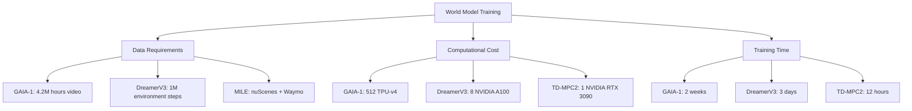

# World Models: The Imagination Engine of Autonomous Vehicles

<div align="center">

*"The ability to imagine possible futures is perhaps the most remarkable feature of intelligence."*

[](#core-models)
[](#research-papers)
[](#av-applications)

</div>

---

## What Are World Models?

World models are **generative neural architectures** that learn compressed representations of environmental dynamics. In the context of autonomous vehicles, they serve as:

- **Mental Simulators**: Predicting how traffic scenarios unfold
- **Virtual Environments**: Testing edge cases without real-world risk  
- **Future Predictors**: Anticipating pedestrian, vehicle, and weather behaviors
- **Planning Oracles**: Enabling model-based reinforcement learning

---

## Core Models Taxonomy

### **Generative World Models**
*Models that can synthesize realistic driving scenarios*

| Model | Year | Key Innovation | AV Relevance | Code |
|-------|------|----------------|--------------|------|
| **GAIA-1** | 2023 | Multimodal video generation for driving | Direct driving simulation | [Wayve](https://wayve.ai/thinking/introducing-gaia1/) |
| **MILE** | 2022 | Multimodal world model for end-to-end driving | Complete AV pipeline | [GitHub](https://github.com/wayveai/mile) |
| **VideoWorldSim** | 2025 | Video-based simulation for AV testing | Synthetic scenario generation | Coming Soon |
| **Genie** | 2024 | Interactive environment generation from images | Traffic scenario synthesis | [Google](https://sites.google.com/view/genie-2024) |

### **Model-Based RL Agents**
*Learning dynamics for control and planning*

| Model | Year | Key Innovation | AV Relevance | Code |
|-------|------|----------------|--------------|------|
| **DreamerV3** | 2023 | Universal world model for continuous control | Driving policy learning | [GitHub](https://github.com/danijar/dreamerv3) |
| **MuZero** | 2020 | Learning dynamics without environment model |  Strategic planning | [DeepMind](https://github.com/deepmind/open_spiel) |
| **TD-MPC2** | 2024 | Task-driven model predictive control | Real-time AV control | [GitHub](https://github.com/nicklashansen/tdmpc2) |
| **EfficientZero** | 2021 | Sample-efficient model-based RL | Data-efficient training | [GitHub](https://github.com/YeWR/EfficientZero) |

### **Dynamics Learning**
*Understanding the physics of driving environments*

| Model | Year | Key Innovation | AV Relevance | Code |
|-------|------|----------------|--------------|------|
| **Neural ODEs** | 2018 | Continuous-time dynamics modeling | Smooth trajectory prediction | [GitHub](https://github.com/rtqichen/torchdiffeq) |
| **Koopman Networks** | 2020 | Linear representation of nonlinear dynamics | Vehicle dynamics modeling | [GitHub](https://github.com/deepmind/deepmind-research) |
| **PETS** | 2018 | Probabilistic ensemble dynamics | Uncertainty-aware planning | [GitHub](https://github.com/kchua/handful-of-trials) |

---

## AV-Specific Applications

### **Scenario Simulation**
World models can generate diverse traffic scenarios for training and testing:

```python
# Conceptual GAIA-1 style generation
scenario = world_model.generate(
    context="Urban intersection, rainy day",
    actors=["pedestrian", "cyclist", "sedan"], 
    duration=10.0,  # seconds
    weather="rain",
    time_of_day="dusk"
)
```

**Key Papers:**
-  [GAIA-1: A Generative World Model for Autonomous Driving](https://wayve.ai/thinking/introducing-gaia1/) (Wayve, 2023)
-  [Learning to Drive from a World on Rails](https://arxiv.org/abs/2105.00636) (Chen et al., 2021)
-  [CARLA: An Open Urban Driving Simulator](https://arxiv.org/abs/1711.03938) (Dosovitskiy et al., 2017)

### **Predictive Planning**
Using learned dynamics for multi-step trajectory optimization:

```python
# DreamerV3-style planning
def plan_trajectory(world_model, current_state, goal):
    imagined_trajectories = []
    for _ in range(num_candidates):
        trajectory = world_model.rollout(
            start_state=current_state,
            horizon=planning_horizon,
            policy=candidate_policy()
        )
        imagined_trajectories.append(trajectory)
    return select_best_trajectory(imagined_trajectories, goal)
```

**Key Papers:**
-  [Mastering Diverse Domains through World Models](https://arxiv.org/abs/2301.04104) (Hafner et al., 2023)
-  [TD-MPC2: Scalable, Robust World Models for Continuous Control](https://arxiv.org/abs/2310.16828) (Hansen et al., 2024)
-  [Model-Based Reinforcement Learning for Autonomous Driving](https://arxiv.org/abs/2006.15618) (Kiran et al., 2020)

### **Edge Case Generation**
Synthesizing rare but critical driving scenarios:

```python
# Edge case sampling
edge_cases = world_model.sample_rare_events(
    base_scenario="highway_merge",
    rare_events=["sudden_brake", "debris_on_road", "emergency_vehicle"],
    probability_threshold=0.001  # Very rare events
)
```

**Key Papers:**
-  [Learning by Cheating in Autonomous Driving](https://arxiv.org/abs/1912.12294) (Chen et al., 2020)
-  [Generating Adversarial Driving Scenarios in High-Fidelity Simulators](https://arxiv.org/abs/2101.06549) (Feng et al., 2021)

---

##  Research Frontiers- Latest updates

### **Video Generation for AVs**
- **Challenge**: Creating photorealistic, physically consistent driving videos
- **Breakthrough**: GAIA-1's ability to generate 20-second driving clips
- **Future**: Real-time scenario generation for training

### **Multimodal World Models**
- **Challenge**: Integrating vision, LiDAR, radar, and language
- **Breakthrough**: MILE's unified multimodal architecture
- **Future**: Cross-modal reasoning and grounding

### **Real-Time Inference**
- **Challenge**: <100ms latency requirements for safety-critical applications
- **Breakthrough**: TD-MPC2's efficient GPU parallelization
- **Future**: Edge-optimized world model architectures

### **Open Research Questions**

1. **How can world models handle distributional shift?**
   - Urban → Rural → Highway domain gaps
   - Different countries' driving cultures
   - Seasonal and weather variations

2. **How do we measure world model quality?**
   - Beyond pixel-level reconstruction metrics
   - Semantic consistency and physical plausibility
   - Long-term prediction stability

3. **Can world models ensure safety guarantees?**
   - Probabilistic safety constraints
   - Worst-case scenario bounds
   - Verification and validation frameworks

---

## Comparative Analysis


### Training Requirements



---

## Essential Resources

###  **Foundational Papers**
1. [World Models](https://arxiv.org/abs/1803.10122) - Ha & Schmidhuber, 2018
2. [Dream to Control](https://arxiv.org/abs/1912.01603) - Hafner et al., 2020
3. [Mastering Atari with Unrestricted World Models](https://arxiv.org/abs/2301.04104) - Hafner et al., 2023

### **Implementation Guides**
- [DreamerV3 Tutorial](https://github.com/danijar/dreamerv3#tutorial)
- [World Models from Scratch](https://worldmodels.github.io/)
- [CARLA World Model Training](https://carla.readthedocs.io/en/latest/adv_agents/)

###  **Datasets for World Model Training**
- **nuScenes**: 1000 driving scenes, multimodal sensors
- **Waymo Open**: 1000 hours, global coverage
- **CARLA**: Infinite synthetic scenarios
- **GAIA-1 Dataset**: 4.2M hours of driving video (proprietary)

---

## Future Directions
- Standardized benchmarks for world model evaluation
- Open-source implementations of GAIA-1 style models
- Multi-agent world models for interactive scenarios
- Real-time world models for production AVs
- Language-conditioned scenario generation
- Cross-cultural driving behavior modeling
- Fully autonomous world model-based AVs
- Sim-to-real transfer without domain gaps
- Universal world models across all driving domains

---
